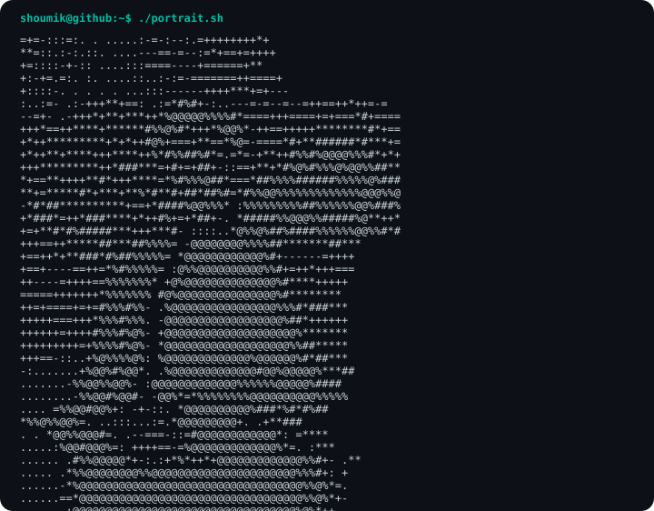

<div align="center">

# `shoumik@github ~ $ whoami`

### Information Engineering · Data & BI · AI Automation

Building practical systems that turn messy data into reliable decisions.

[](https://github.com/ShoumikDutta)
[](https://github.com/ShoumikDutta?tab=followers)

</div>

<div align="center">



</div>

---

### `shoumik@github ~ $ ./about.sh`

```yaml
name: Shoumik Dutta
location: Hamburg, Germany
education: B.Sc. Information Engineering — HAW Hamburg
focus:
  - Business Intelligence & Analytics
  - Data Engineering & Validation
  - AI Agents & Workflow Automation
  - Financial Data Systems
currently_learning:
  - Machine Learning
  - Cloud & Production Data Workflows
  - German
```

### `shoumik@github ~ $ ./toolbox.sh`

<div align="center">


</div>

### `shoumik@github ~ $ ./featured_work.sh`

```text
CRM Data Quality Agent
└─ FastAPI agent · automated validation · audit trail · Power BI

Financial Data Pipeline
└─ Python · market and macro data · PostgreSQL · validation · Streamlit

Timesheet Compliance Engine
└─ rule-based controls · exception monitoring · reporting automation

Trading Strategy Research
└─ signal generation · paper trading · performance analytics
```

### `shoumik@github ~ $ ./activity.sh`

```text
PUBLIC WORK      Python · C · JavaScript · data and automation projects
CURRENT FOCUS    reliable pipelines · applied AI · decision-ready analytics
BUILD MODE       learn → prototype → validate → improve
```

[View my repositories](https://github.com/ShoumikDutta?tab=repositories) · [View my contribution history](https://github.com/ShoumikDutta?tab=overview&from=2026-01-01&to=2026-12-31)

### `shoumik@github ~ $ ./principles.sh`

```text
$ automate repetitive work
$ validate before visualizing
$ make data products understandable
$ keep learning by building
```

<div align="center">

### Open to collaborating on data, BI, automation and applied-AI projects.

`status: building • learning • improving`

</div>
